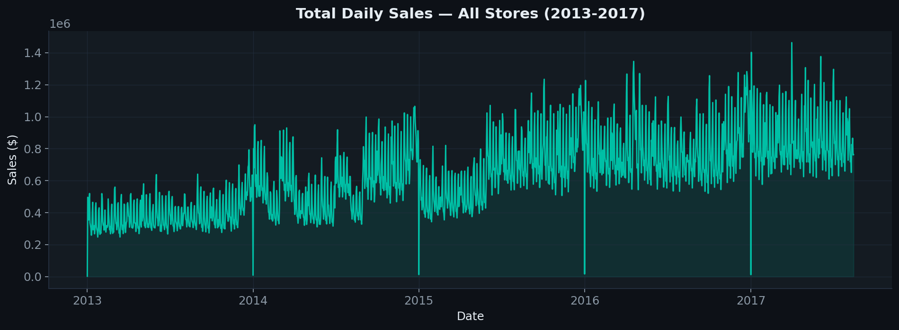
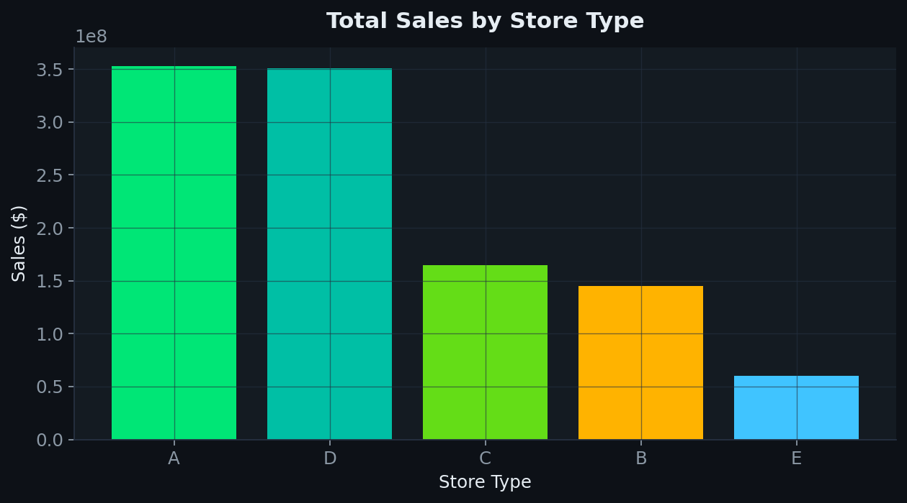
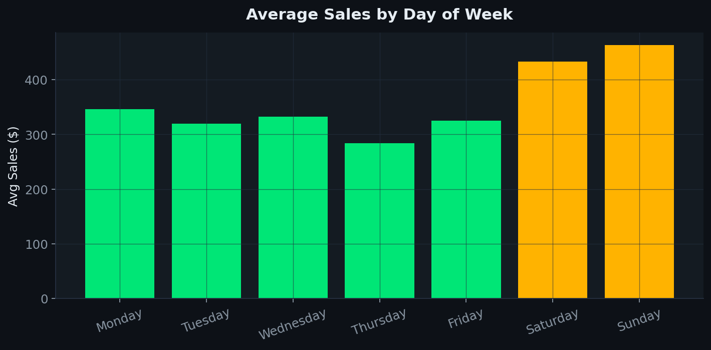
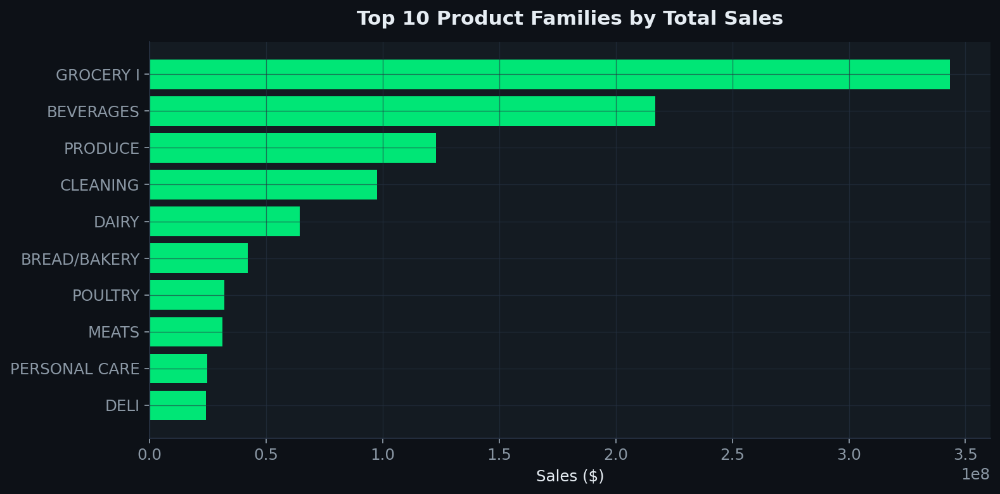
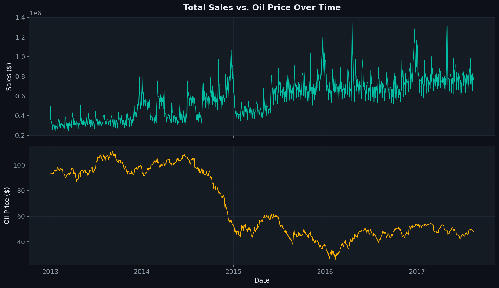
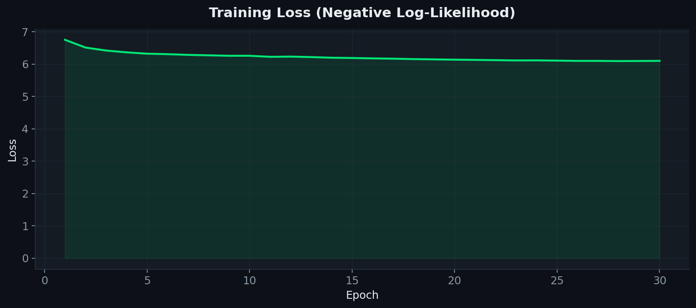
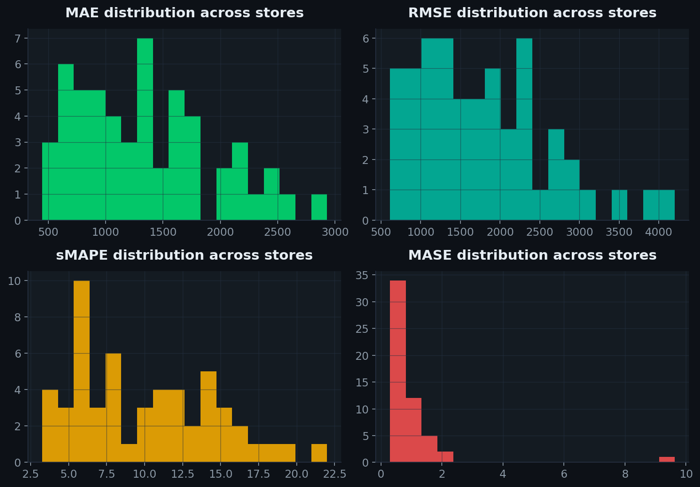
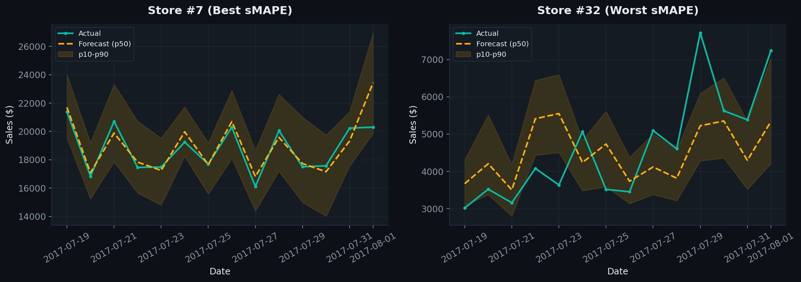
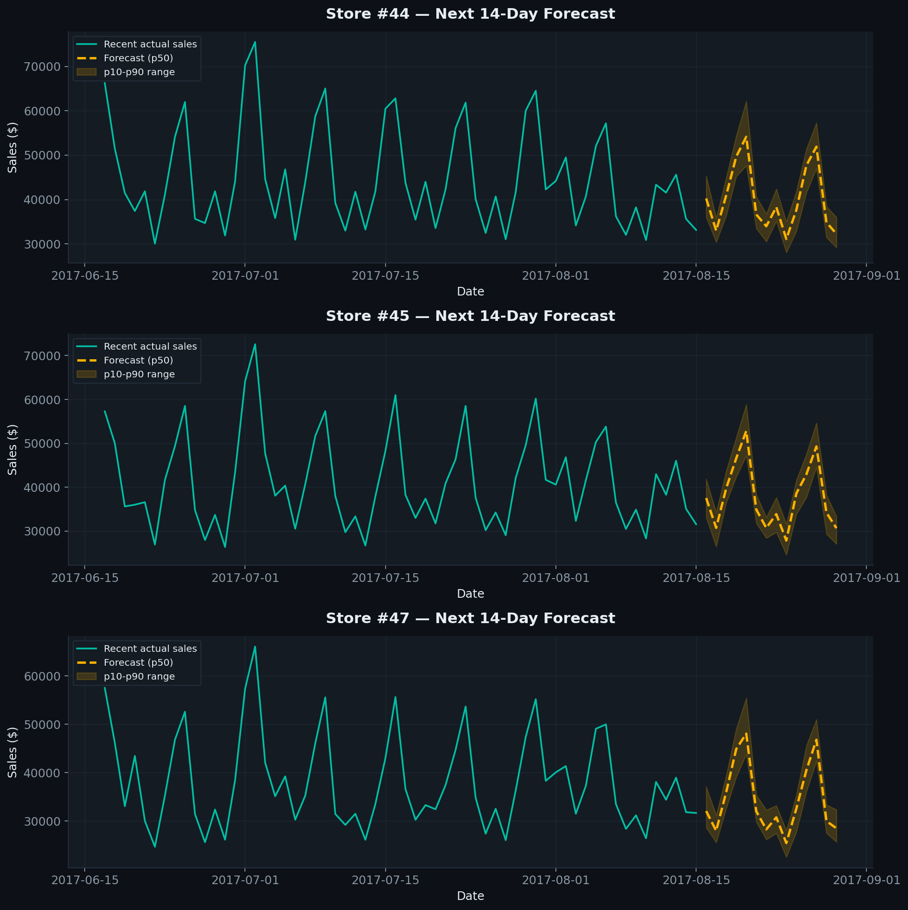

# Store Sales Forecasting — Small Transformer Edition

An end-to-end demand-forecasting system built on the Favorita "Store Sales"
retail dataset (54 stores, 2013–2017 daily sales). A compact HuggingFace
**`TimeSeriesTransformerForPrediction`** model — small enough to train and
run comfortably on a 4GB GPU (tested on an **NVIDIA RTX A2000**) — learns
each store's demand pattern and produces a 14-day-ahead probabilistic sales
forecast. A FastAPI backend serves the trained model, and a React dashboard
(black + dark-green theme) lets anyone browse forecasts per store and log
new daily sales.

---

## 1. What's in this repository

| Area | Description |
|---|---|
| `data_raw/` | Original Kaggle "Store Sales — Time Series Forecasting" CSVs |
| `src/` | Reusable pipeline: preprocessing, windowing dataset, model, training, evaluation, inference, plotting |
| `notebooks/01_end_to_end_forecasting.ipynb` | Full, runnable, end-to-end notebook — EDA → preprocessing → training → backtesting → future forecasts |
| `models/time_series_transformer/` | Saved trained model weights + config (reloadable without retraining) |
| `outputs/figures/`, `outputs/tables/` | Every chart and table produced by the notebook, used below |
| `api/` | FastAPI backend that serves live forecasts to the frontend |
| `frontend/` | React + Vite dashboard (black/dark-green UI) |

---

## 2. The modeling approach

- **Granularity:** daily total sales per store (54 series), built by
  aggregating the ~3M row transaction-level `train.csv` across all product
  families.
- **Covariates:** calendar features (day-of-week, day-of-month, day-of-year,
  month, weekend flag), items on promotion, store transaction counts, oil
  price, and holiday/event flags.
- **Model:** `TimeSeriesTransformerForPrediction` from HuggingFace
  `transformers` — a probabilistic encoder-decoder transformer purpose-built
  for time series. Configured small on purpose:
  - `d_model = 32`, 2 encoder layers, 2 decoder layers, 2 attention heads
  - Context window: 60 days of history (+ lag features at 1/2/3/7/14/21/28 days)
  - Forecast horizon: next **14 days**
  - **~41,000 trainable parameters** — the full training run (54 stores,
    30 epochs) completed in under 10 minutes on the RTX A2000, using a small
    fraction of its 4GB of VRAM.
- **Output:** the model is distributional, not a single point estimate — it
  samples 100 future trajectories per store, from which the median (p50)
  forecast and a p10–p90 uncertainty band are derived.

---

## 3. Results

### 3.1 Exploratory data analysis

**Total daily sales across all stores (2013–2017)**



**Sales by store type**



**Weekly seasonality — average sales by day of week**



**Top product families by total sales**



**Total sales vs. oil price**



### 3.2 Training



### 3.3 Backtest accuracy (last 14 held-out days, all 54 stores)

| Metric | Value |
|---|---|
| MAE | $1,346 |
| RMSE | $1,787 |
| sMAPE | 10.0% |
| MASE | 0.94 |

A MASE below 1.0 means the model beats a naive weekly-seasonal baseline
(repeating last week's sales) on average across all 54 stores.

Overall metrics (averaged across stores) are in
[`outputs/tables/backtest_metrics_overall.csv`](outputs/tables/backtest_metrics_overall.csv),
and the per-store breakdown is in
[`outputs/tables/backtest_metrics_per_store.csv`](outputs/tables/backtest_metrics_per_store.csv).



**Best vs. worst store (by sMAPE)**



### 3.4 Genuine future forecasts (next 14 days beyond the dataset)



Raw forecast values for the showcased stores are saved in
[`outputs/tables/future_forecasts_showcase.csv`](outputs/tables/future_forecasts_showcase.csv).

---

## 4. Running it yourself

### 4.1 Environment

Everything runs in the conda environment **`myenv`**, which has PyTorch
(CUDA build, verified against the RTX A2000), `transformers`, `accelerate`,
`pandas`, `scikit-learn`, `matplotlib`, `jupyter`, `fastapi`, and `uvicorn`
installed. See `requirements.txt` for the full package list if you need to
recreate it elsewhere (`conda activate myenv` before running anything below).

### 4.2 Reproduce the pipeline

1. Preprocess the raw CSVs into the daily per-store panel: run the
   preprocessing step (`src/data_preprocessing.py`), or just open and run
   the notebook, which does this for you.
2. Open `notebooks/01_end_to_end_forecasting.ipynb` and run all cells top to
   bottom. It will re-create every figure/table in this README and re-save
   the trained model to `models/time_series_transformer/`.
3. Alternatively, run the equivalent pipeline scripts directly: training
   (`src/train.py`), backtesting (`src/evaluate.py`), and inference
   (`src/predict.py`) are all importable modules used by both the notebook
   and the API.

### 4.3 Start the backend API

`./run_backend.sh` activates the `myenv` environment and launches the
FastAPI server (`api/main.py`) on port 8000. It loads the saved model once
at startup and exposes store metadata, history, forecasts, and a data-entry
endpoint to the frontend.

### 4.4 Start the frontend dashboard

`./run_frontend.sh` installs frontend dependencies and starts the Vite dev
server (default port 5173). The dashboard lets you:

- Browse all 54 stores from the sidebar (search by store number, city or state)
- View KPI cards (sales trend, average daily sales, latest data point)
- See a store's last 120 days of actual sales alongside the model's next
  14-day forecast, with a shaded p10–p90 uncertainty band
- Add a new daily sales record for any store through a form — new records
  are appended to `backend_data/user_added_data.csv` and immediately folded
  into that store's forecast on the next request

---

## 5. Project layout

```
market-store-sales-time-series-forecasting/
├── data_raw/                  Original Kaggle CSVs
├── data_processed/            Generated daily per-store panel (parquet)
├── src/                       Pipeline modules (preprocessing, dataset, model, train, evaluate, predict, plotting)
├── notebooks/                 End-to-end Jupyter notebook
├── models/time_series_transformer/   Saved trained model
├── outputs/figures/           Saved PNG charts
├── outputs/tables/            Saved CSV tables
├── api/                       FastAPI backend
├── frontend/                  React + Vite dashboard
├── backend_data/              User-submitted sales records (CSV log)
├── run_backend.sh / run_frontend.sh
└── requirements.txt
```
